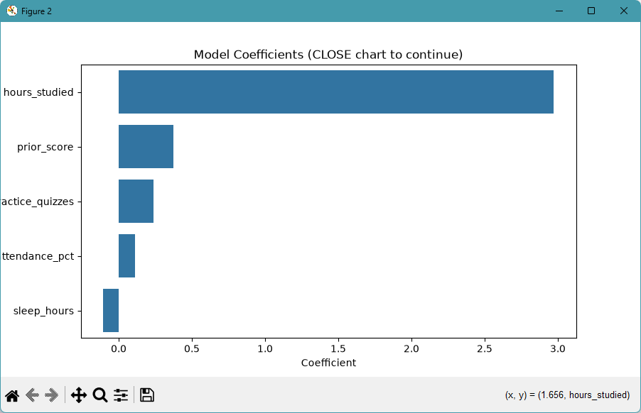

# ml-03-classification

[](https://denisecase.github.io/pro-analytics-02/workflow-b-apply-example-project/)
[](./pyproject.toml)
[](./LICENSE)

> Professional Python project: building and evaluating classification models.

## Project Description

This project focuses on how to build models that predict a category.

We learn to:

- train and evaluate a classifier (e.g., decision tree, logistic regression, k-NN)
- read a confusion matrix and classification report
- interpret accuracy, precision, recall, and F1
- choose a model based on the problem and the data

## Example Notebook + Your Notebook

Links:

- [ml_03_case.ipynb](notebooks/ml_03_case.ipynb)
- [ml_03_gracecode42.ipynb](notebooks/ml_03_gracecode42.ipynb)

## Command Reference

<details>
<summary>Show command reference</summary>

### In a machine terminal (open in your `Repos` folder)

After you get a copy of this repo in your own GitHub account,
open a machine terminal in your `Repos` folder:

```shell
git clone https://github.com/gracecode42/ml-03-classification

cd ml-03-classification
code .
```

### In a VS Code terminal

These are listed for convenience.
For best results, follow the detailed instructions in
[pro-analytics-02 guide](https://denisecase.github.io/pro-analytics-02/).

```shell
uv self update
uv python pin 3.14
uv lock --upgrade
uv sync --extra dev --extra docs --upgrade

uvx pre-commit install
uvx pre-commit autoupdate

git add -A
uvx pre-commit run --all-files
# repeat if changes were made
uvx pre-commit run --all-files

# run the example module to verify the environment (.venv/)
uv run python -m mlstudio.app_case

# run common chores
uv run ruff format .
uv run ruff check . --fix
uv run python -m pyright
uv run python -m pytest
uv run python -m zensical build

# save progress
git add -A
git commit -m "update"
git push -u origin main

# run notebook
# open notebook files
# select Kernel associated with project .venv
# click Run All
```

</details>

## Findings and Visuals

Update figures to present interesting results from your custom project:




## Project Documentation

Additional project instructions, terms, and notes:

[docs/index.md](docs/index.md)

## Citation

[CITATION.cff](./CITATION.cff)

## License

[MIT](./LICENSE)
