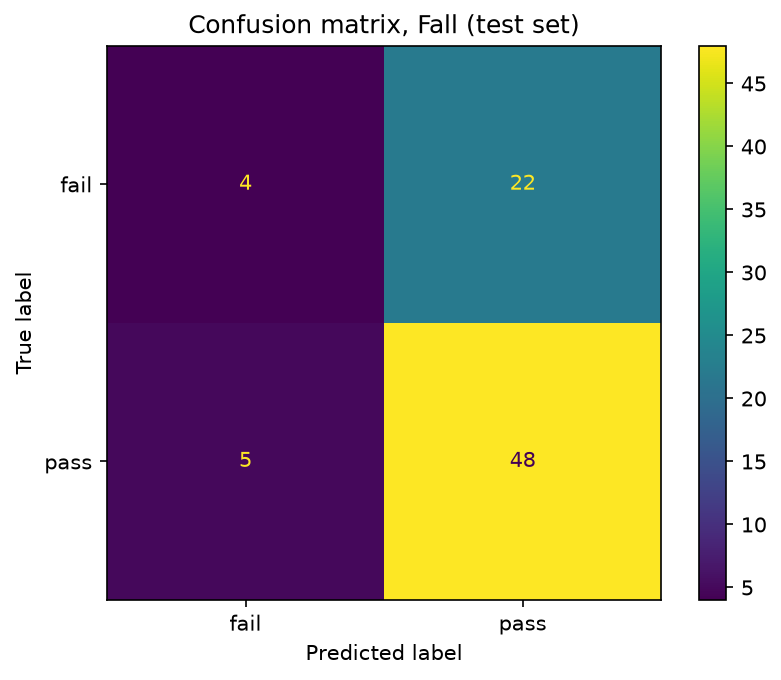
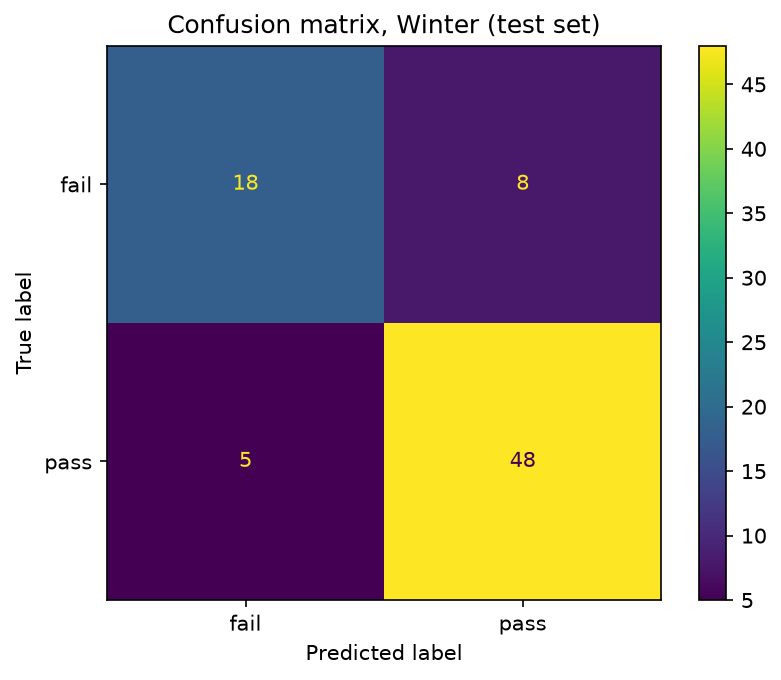
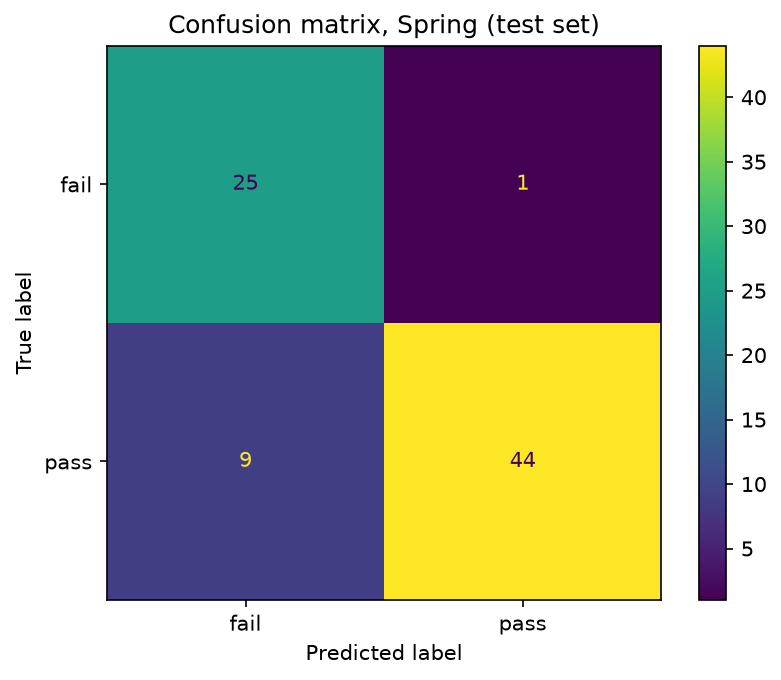
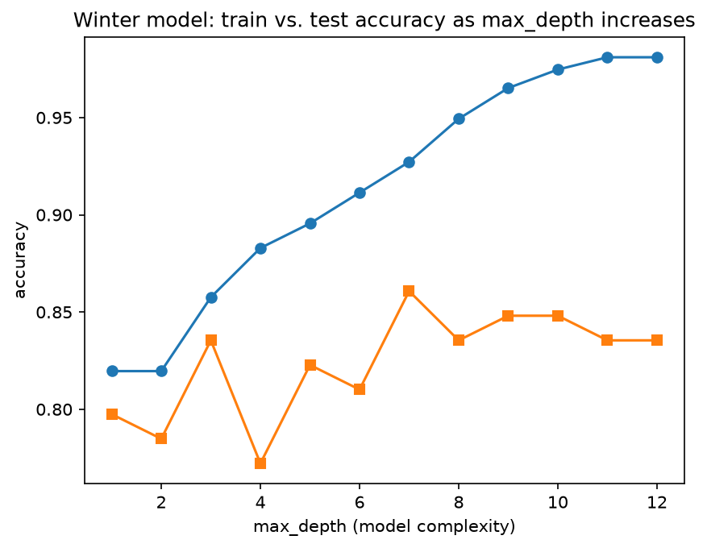

# ml-03-classification

[](https://denisecase.github.io/pro-analytics-02/workflow-b-apply-example-project/)
[](./pyproject.toml)
[](./LICENSE)

> Professional Python project: building and evaluating classification models.

## Project Description

This project trains a decision tree to classify students as pass or fail on the UCI Student Performance data (student-mat). The target is built from the final grade G3, with 10 or above on the 0 to 20 scale counting as a pass.

The question comes from my work as a learning center coordinator: can we predict which students are at risk in time to provide proactive support? The design turns on when the prediction is made, because that decides how much of the grade record exists yet. G1, G2, and G3 are three grading periods of one math course, so I built three prediction points, labeled fall, winter, and spring, and trained the same decision tree at each. The result is a comparison of how predictive power changes as more of the record becomes available.

The work covers:

- constructing a categorical target (pass/fail) from a continuous grade
- stratified train/test splitting on an imbalanced target
- training a decision tree and selecting max_depth from a train/test accuracy sweep
- evaluating with confusion matrices and per-class precision, recall, and F1
- selecting recall on the at-risk class as the decision metric, with justification

## Example Notebook + Your Notebook

- [ml_03_case.ipynb](notebooks/ml_03_case.ipynb) — the course example (penguins)
- [ml_03_gracecode42.ipynb](notebooks/ml_03_gracecode42.ipynb) — this project: student pass/fail across three prediction points

## Command Reference

<details>
<summary>Show command reference</summary>

### In a machine terminal (open in your `Repos` folder)

After you get a copy of this repo in your own GitHub account,
open a machine terminal in your `Repos` folder:

```shell
git clone https://github.com/gracecode42/ml-03-classification

cd ml-03-classification
code .
```

### In a VS Code terminal

These are listed for convenience.
For best results, follow the detailed instructions in
[pro-analytics-02 guide](https://denisecase.github.io/pro-analytics-02/).

```shell
uv self update
uv python pin 3.14
uv lock --upgrade
uv sync --extra dev --extra docs --upgrade

uvx pre-commit install
uvx pre-commit autoupdate

git add -A
uvx pre-commit run --all-files
# repeat if changes were made
uvx pre-commit run --all-files

# run the example module to verify the environment (.venv/)
uv run python -m mlstudio.app_case

# run common chores
uv run ruff format .
uv run ruff check . --fix
uv run python -m pyright
uv run python -m pytest
uv run python -m zensical build

# save progress
git add -A
git commit -m "update"
git push -u origin main

# run notebook
# open notebook files
# select Kernel associated with project .venv
# click Run All
```

</details>

## Findings and Visuals

Predictive power grows as more of the grade record becomes available. The test set holds 79 students, 26 of whom fail. Fall, before any grades exist, does no better than guessing that everyone passes and catches only 4 of the 26. Winter, with the first period grade G1, catches 18. Spring, with G1 and G2, catches 25. Confusion matrices label actual on the rows and predicted on the columns.







The depth sweep on the Winter model shows test accuracy near its best at max_depth 3, where the gap between train and test is smallest. Past that depth, train accuracy keeps rising while test does not, which is overfitting.



## Project Documentation

Additional project instructions, terms, and notes:

[docs/index.md](docs/index.md)

## Citation

[CITATION.cff](./CITATION.cff)

## License

[MIT](./LICENSE)
